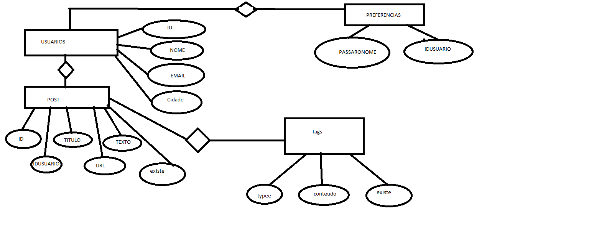
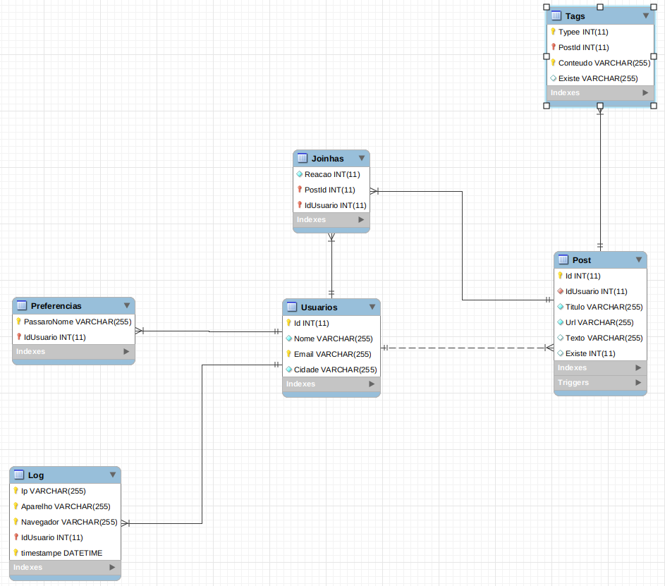

### SCHEMA

```sql
#DROP DATABASE IF EXISTS MD;

#CREATE DATABASE MD;
USE MD;

DROP TABLE IF EXISTS Log;
DROP TABLE IF EXISTS Preferencias;

DROP TABLE IF EXISTS Tags;
DROP TABLE IF EXISTS Post;
DROP TABLE IF EXISTS Usuarios;


CREATE TABLE Usuarios (
    Id int AUTO_INCREMENT,
    Nome varchar(255) NOT NULL,
    Email varchar(255) UNIQUE,
    Cidade varchar(255) NOT NULL,
    PRIMARY KEY (Id, Email)
);

CREATE TABLE Preferencias (
    PassaroNome VARCHAR(255),
    IdUsuario int NOT NULL,
	PRIMARY KEY (IdUsuario, PassaroNome),
    FOREIGN KEY (IdUsuario) REFERENCES Usuarios(Id)
);

CREATE TABLE Post (
    Id INT AUTO_INCREMENT,
    IdUsuario INT NOT NULL,
    Titulo VARCHAR(255) NOT NULL,
    Url VARCHAR(255) NOT NULL,
    Texto VARCHAR(255),
    Existe int DEFAULT 1,
    PRIMARY KEY (Id),
    FOREIGN KEY (IdUsuario)
        REFERENCES Usuarios(Id)
);

CREATE TABLE Tags (
    Typee INT,
    PostId INT NOT NULL,
    Conteudo VARCHAR(255) NOT NULL,
    Existe VARCHAR(255),
    PRIMARY KEY (Typee , PostId , Conteudo),
    FOREIGN KEY (PostId)
        REFERENCES Post (Id)
);

CREATE TABLE Log (
    Ip VARCHAR(255),
    Aparelho VARCHAR(255) NOT NULL,
    Navegador VARCHAR(255) NOT NULL,
    IdUsuario int NOT NULL,
    timestampe DATETIME DEFAULT CURRENT_TIMESTAMP ON UPDATE CURRENT_TIMESTAMP,
    PRIMARY KEY (timestampe , Ip, Navegador, Aparelho, IdUsuario),
    FOREIGN KEY (IdUsuario) REFERENCES Usuarios(Id)
);

DELIMITER $$
CREATE TRIGGER Post_check BEFORE UPDATE ON Post
FOR EACH ROW
BEGIN
	UPDATE Tags SET Existe = NEW.Existe WHERE
		PostId = NEW.Id;
END$$
DELIMITER ;
```

## MODELO ENTIDADE-RELACIONAMENTO


## MODELO RELACIONAL



## DESCRICAO DE TABELAS

TABELA | DESCRICAO
--- | ---
Usuarios | Tabela que armazena as informacoes principais dos usuarios
Preferencias | Tabela que armazena as preferencias de passaros dos usuarios podendo ser qualquer nome
Post | Tabela que armazena todos os posts da rede social feito por usuarios
Tags | Tabela que armazena todos as tags presentes no post relacionado


## USUARIOS

NOME | DESCRICAO | AUTO-GERADA | PK | FK | RESTRICOES
--- | --- | --- | --- | --- | ---
ID | O Id para a representacao do usuario no banco de dados | sim |sim |nao | nao
Nome | O nome que o usuario tem | nao |nao |nao | nao nulo
Email | O nome que o usuario tem | nao |nao |nao | tem que ser unico
Nome | A cidade do usuario | nao |nao |nao | nao nulo


## PREFERENCIAS

NOME | DESCRICAO | AUTO-GERADA | PK | FK | RESTRICOES
--- | --- | --- | --- | --- | ---
IDUSUARIO | O Id para a representacao do usuario no banco de dados | nao |sim  |sim (Usuario)| nao
PassaroNome | O nome do passaro preferido do usuario | nao |sim |nao | nao nulo


## POSTS

NOME | DESCRICAO | AUTO-GERADA | PK | FK | RESTRICOES
--- | --- | --- | --- | --- | ---
ID | O Id para a representacao do post no banco de dados | sim |sim |nao | nao
IDUSUARIO | O Id para a representacao do usuario no banco de dados | nao |sim  |sim(Usuario) | nao
Titulo | O titulo do post | nao |nao |nao | nao nulo
Url | Url para a imagem do passaro | nao |nao |nao | nao
texto | O texto que o usuario pretende colocar juntamente ao seu post | nao |nao |nao | nao


## TAGS

NOME | DESCRICAO | AUTO-GERADA | PK | FK | RESTRICOES
--- | --- | --- | --- | --- | ---
Typee | O tipo de tag que foi usada, se foi um shout ou uma hashtag | nao |sim |nao | nao
PostId | O Id de em qual post a tag foi usada para poder ser relacionado | nao |sim  |sim (Posts)| nao
Conteudo | A quem a tag esta se referenciando | nao |sim |nao | nao nulo
Existe | O delete logico da tag para quando for deletado o post | nao |nao |nao | nao nulo


## LOG

NOME | DESCRICAO | AUTO-GERADA | PK | FK | RESTRICOES
--- | --- | --- | --- | --- | ---
ip | De qual ip que veio a requisicao | nao |sim |nao | nao nulo
aparelho | Em qual aparelho que foi feita a requisicao | nao |sim  |nao| nao nulo
navegador | Em qual navegador foi feita a requisicao | nao |sim |nao | nao nulo
IDUSUARIO | O Id para a representacao do usuario no banco de dados | nao |sim  |sim (Usuario)| nao
timestamp | Qual a data da requisicao | sim (timestamp default) |sim |nao | nao


## LOG

NOME | DESCRICAO | AUTO-GERADA | PK | FK | RESTRICOES
--- | --- | --- | --- | --- | ---
Reacao | Se a reação dauele usuario foi positiva ou negativa | nao |nao |nao | nao nulo
IDUSUARIO | O Id para a representacao do usuario no banco de dados | nao |sim  |sim (Usuario)| nao
PostId | O Id de em qual post a tag foi usada para poder ser relacionado | nao |sim  |sim (Posts)| nao