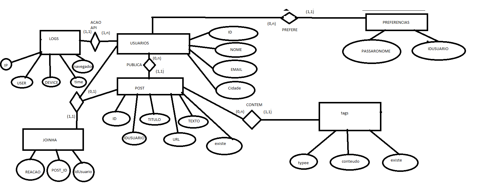

# Use the uvicorn to run the app

### Windows

#### change the path of mysql to "C:\\Program Files\\MySQL\\MySQL Server 8.0\\bin\\mysql" and username & password in config_test.json

```batch
%USERPROFILE%\AppData\Local\Programs\Python\Python37-32\Scripts\pip install uvicorn
%USERPROFILE%\AppData\Local\Programs\Python\Python37-32\Lib\site-packages\uvicorn\main.py fast_api:app --reload
```

or 

```batch
pip install uvicorn
uvicorn fast_api:app --reload
```


### Linux

#### change the path of mysql to "/usr/bin/mysql" and username & password in config_test.json

```shell
pip3 install uvicorn
uvicorn fast_api:app --reload
```


### API documentation

#### available after the server start at http://localhost:8000/docs#/


### SCHEMA

## MODELO ENTIDADE-RELACIONAMENTO


## MODELO RELACIONAL


## REQUISITOS FUNCIONAIS
- 


## DESCRICAO DE TABELAS

TABELA | DESCRICAO
--- | ---
Usuarios | Tabela que armazena as informacoes principais dos usuarios
Preferencias | Tabela que armazena as preferencias de passaros dos usuarios podendo ser qualquer nome
Post | Tabela que armazena todos os posts da rede social feito por usuarios
Tags | Tabela que armazena todos as tags presentes no post relacionado


## USUARIOS

NOME | DESCRICAO | AUTO-GERADA | PK | FK | RESTRICOES
--- | --- | --- | --- | --- | ---
ID | O Id para a representacao do usuario no banco de dados | sim |sim |nao | nao
Nome | O nome que o usuario tem | nao |nao |nao | nao nulo
Email | O nome que o usuario tem | nao |nao |nao | tem que ser unico
Nome | A cidade do usuario | nao |nao |nao | nao nulo


## PREFERENCIAS

NOME | DESCRICAO | AUTO-GERADA | PK | FK | RESTRICOES
--- | --- | --- | --- | --- | ---
IDUSUARIO | O Id para a representacao do usuario no banco de dados | nao |sim  |sim (Usuario)| nao
PassaroNome | O nome do passaro preferido do usuario | nao |sim |nao | nao nulo


## POSTS

NOME | DESCRICAO | AUTO-GERADA | PK | FK | RESTRICOES
--- | --- | --- | --- | --- | ---
ID | O Id para a representacao do post no banco de dados | sim |sim |nao | nao
IDUSUARIO | O Id para a representacao do usuario no banco de dados | nao |sim  |sim(Usuario) | nao
Titulo | O titulo do post | nao |nao |nao | nao nulo
Url | Url para a imagem do passaro | nao |nao |nao | nao
texto | O texto que o usuario pretende colocar juntamente ao seu post | nao |nao |nao | nao


## TAGS

NOME | DESCRICAO | AUTO-GERADA | PK | FK | RESTRICOES
--- | --- | --- | --- | --- | ---
Typee | O tipo de tag que foi usada, se foi um shout ou uma hashtag | nao |sim |nao | nao
PostId | O Id de em qual post a tag foi usada para poder ser relacionado | nao |sim  |sim (Posts)| nao
Conteudo | A quem a tag esta se referenciando | nao |sim |nao | nao nulo
Existe | O delete logico da tag para quando for deletado o post | nao |nao |nao | nao nulo


## LOG

NOME | DESCRICAO | AUTO-GERADA | PK | FK | RESTRICOES
--- | --- | --- | --- | --- | ---
ip | De qual ip que veio a requisicao | nao |sim |nao | nao nulo
aparelho | Em qual aparelho que foi feita a requisicao | nao |sim  |nao| nao nulo
navegador | Em qual navegador foi feita a requisicao | nao |sim |nao | nao nulo
IDUSUARIO | O Id para a representacao do usuario no banco de dados | nao |sim  |sim (Usuario)| nao
timestamp | Qual a data da requisicao | sim (timestamp default) |sim |nao | nao


## JOINHAS

NOME | DESCRICAO | AUTO-GERADA | PK | FK | RESTRICOES
--- | --- | --- | --- | --- | ---
Reacao | Se a reação dauele usuario foi positiva ou negativa | nao |nao |nao | nao nulo
IDUSUARIO | O Id para a representacao do usuario no banco de dados | nao |sim  |sim (Usuario)| nao
PostId | O Id de em qual post a tag foi usada para poder ser relacionado | nao |sim  |sim (Posts)| nao

